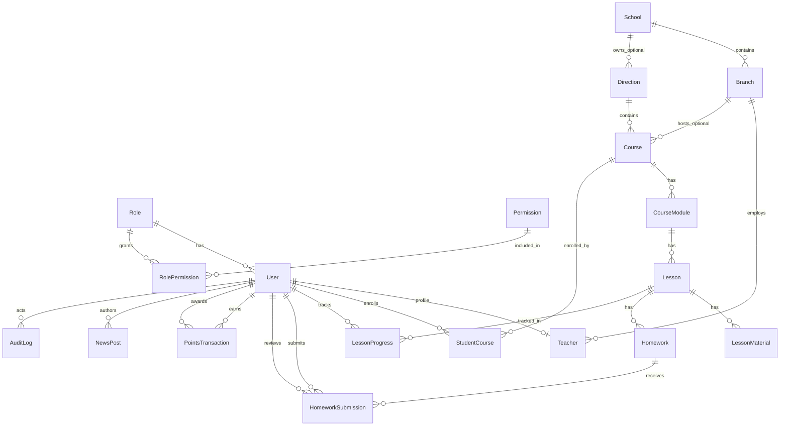

# Maestro — ERD (Entity Relationship Diagram)

## Обзор доменов

```text
┌─────────────┐     ┌──────────────┐     ┌─────────────┐
│   RBAC      │     │  Multi-tenant │     │   Catalog   │
│ roles       │     │ schools       │     │ directions  │
│ permissions │     │ branches      │     │ courses     │
│ users       │     │ teachers      │     │ modules     │
└─────────────┘     └──────────────┘     │ lessons     │
                                         └─────────────┘
┌─────────────┐     ┌──────────────┐     ┌─────────────┐
│  Progress   │     │   Homework   │     │ Gamification│
│ enrollments │     │ submissions  │     │ points_ledger│
│ lesson_prog │     └──────────────┘     └─────────────┘
└─────────────┘
        ┌─────────────┐     ┌─────────────┐
        │  News Board │     │ Audit Logs  │
        └─────────────┘     └─────────────┘
```

## Mermaid ERD



## Таблицы и связи

| Сущность | PK | Основные FK | Уникальность / индексы |
|----------|-----|-------------|------------------------|
| `roles` | uuid | — | `slug` UNIQUE |
| `permissions` | uuid | — | `code` UNIQUE |
| `role_permissions` | uuid | role_id, permission_id | UNIQUE(role_id, permission_id) |
| `users` | uuid | role_id | `email` UNIQUE; INDEX(role_id, deleted_at) |
| `schools` | uuid | — | `slug` UNIQUE |
| `branches` | uuid | school_id | UNIQUE(school_id, slug) |
| `teachers` | uuid | user_id, branch_id? | `user_id` UNIQUE |
| `directions` | uuid | school_id? | `slug` UNIQUE |
| `courses` | uuid | direction_id, branch_id? | INDEX(direction_id, is_published) |
| `course_modules` | uuid | course_id | INDEX(course_id, sort_order) |
| `lessons` | uuid | module_id | INDEX(module_id, sort_order) |
| `lesson_materials` | uuid | lesson_id | INDEX(lesson_id, sort_order) |
| `student_courses` | uuid | student_id, course_id | UNIQUE(student_id, course_id) |
| `lesson_progress` | uuid | student_id, lesson_id | UNIQUE(student_id, lesson_id) |
| `homeworks` | uuid | lesson_id | soft delete |
| `homework_submissions` | uuid | homework_id, student_id | INDEX(student_id, status) |
| `points_transactions` | uuid | student_id, lesson_id?, awarded_by? | INDEX(student_id, created_at) — ledger only |
| `achievements` | uuid | — | `code` UNIQUE |
| `student_achievements` | uuid | student_id, achievement_id | UNIQUE(student_id, achievement_id) |
| `news_posts` | uuid | author_id | INDEX(is_published, published_at) |
| `audit_logs` | uuid | actor_id? | INDEX(entity_type, entity_id), INDEX(created_at) |

## Soft delete

`deleted_at TIMESTAMPTZ NULL` на:

- users, schools, branches, teachers
- directions, courses, course_modules, lessons, homeworks, news_posts

Запросы каталога фильтруют `deleted_at IS NULL`.

## Аудит

`audit_logs` — append-only журнал:

- `entity_type` + `entity_id` — что изменилось
- `action` — create | update | delete | restore | publish | unpublish
- `actor_id` — кто (nullable для системных событий)
- `payload` — JSONB diff / контекст

## Баланс баллов

**Нет поля `balance` у User.**

```sql
SELECT COALESCE(SUM(amount), 0) FROM points_transactions WHERE student_id = $1;
```
