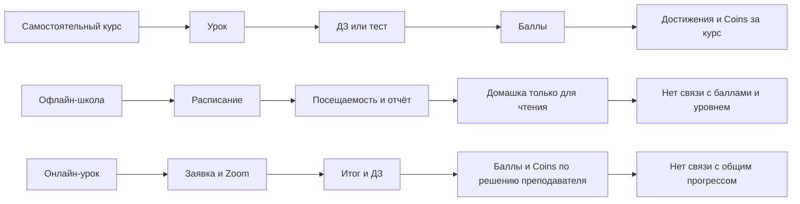

# Аудит приложения Maestro глазами ученика

Дата среза: 22 августа 2026 года
Область: `maestro-learning-platform` — web/PWA, Android TWA и ученические API
Цель документа: зафиксировать, что ученик уже видит и может делать, где функции
реально работают, где они существуют только частично и какие ограничения нужно
учесть перед отдельным планом перестройки главного экрана.

## 1. Как проводился аудит

Проверены:

- все ученические маршруты в `web_app/src/app/(portal)`;
- навигация, главный экран, профиль, уведомления и установка приложения;
- API-клиент и типы ученических данных;
- backend routes, services и Prisma-модели обучения и геймификации;
- логика курсов, уроков, ДЗ, тестов, баллов, Coins и достижений;
- интеграция офлайн-школы с CRM;
- приложенный мобильный экран;
- локальная техническая целостность frontend и backend через TypeScript typecheck.

Статусы в документе:

- **Работает** — есть экран, API и сохранение данных.
- **Частично** — функция работает не во всех учебных контурах или имеет заметное ограничение.
- **Только основа** — модель/тип существует, но ученического продукта ещё нет.
- **Не обнаружено** — в текущем коде нет рабочей реализации.

Аудит выполнен по текущему локальному рабочему дереву, включая незакоммиченные
изменения. Production-данные конкретного ученика и закрытые страницы без
учётной записи в этом срезе не проверялись.

## 2. Краткий вывод

Приложение уже значительно шире обычного кабинета с курсами. Внутри фактически
существуют три разных продукта:

1. самостоятельные онлайн-курсы;
2. офлайн-обучение в школе, синхронизированное с CRM;
3. индивидуальные онлайн-уроки с преподавателем.

Главная страница этого не отражает. При наличии активного курса главный экран
почти целиком строится вокруг него: крупная карточка курса, следующий урок,
повторная карточка продолжения и прогресс того же курса. Ближайшее живое занятие,
свежая офлайн-домашка, новый итог преподавателя и важное сообщение могут быть
актуальнее, но находятся глубже или показываются только через уведомления.

Геймификация существует, но пока не образует игровую систему:

- баллы работают;
- Maestro Coins работают как начисляемый баланс;
- есть четыре достижения;
- есть прогресс отдельных курсов;
- уровня ученика, рангов, серии дней и таблицы лидеров нет;
- Coins пока нельзя тратить;
- офлайн-обучение почти не участвует в геймификации.

Поэтому текущая проблема не только визуальная. Перед новой компоновкой главной
нужно определить единую модель ученика: что считается прогрессом школы, за какие
действия растёт уровень, чем отличаются баллы от Coins и какое действие является
главным «следующим ходом» ученика сегодня.

## 3. Важное расхождение с приложенным экраном

Приложенный экран содержит:

- игровой уровень `Новичок 1`;
- процент прогресса до следующего уровня;
- серию дней;
- крупную карточку ближайшего занятия с временем и преподавателем;
- карточки отдельных навыков с процентами;
- компактные показатели баллов и достижений.

Текущий локальный код не формирует этот экран один в один. В нём используется
светлая оболочка и другая главная: крупный hero текущего курса, баллы/Coins,
число завершённых уроков, следующий курсовый урок, новости, достижения и ещё
одна карточка продолжения обучения.

Особенно важно: `Новичок 1`, серия дней и проценты навыков не имеют рабочей
backend-модели в текущем проекте. В frontend сохранился неиспользуемый тип
`Student.level`, но API, расчёта, таблицы уровней и истории повышения нет.

Если приложенный экран действительно сейчас показывается в production, значит
между production-сборкой и проверенным локальным источником есть расхождение.
Перед редизайном нужно определить единственный актуальный source of truth, иначе
можно спроектировать новую главную поверх механик, которые существуют только в
макете или другой сборке.

## 4. Вход, доступ и установка

### Что видит ученик

**Работает:**

- вход по телефону и паролю;
- вход по SSO-ссылке из CRM;
- показ/скрытие пароля;
- автоматическое восстановление сессии;
- выход из аккаунта;
- смена пароля в профиле;
- отдельная страница, объясняющая, что доступ выдаёт школа;
- ссылка на запись на пробный урок;
- скачивание официального APK для Android;
- установка PWA из Chrome;
- standalone-режим и иконка приложения на телефоне.

### Ограничения

- самостоятельная регистрация ученика через публичную форму фактически закрыта:
  `/register` направляет за доступом к школе;
- iOS не имеет отдельного нативного приложения — используется web/PWA;
- Android-приложение является Trusted Web Activity поверх того же web-интерфейса,
  а не отдельным нативным клиентом;
- push зависит от поддержки браузером, разрешения пользователя и VAPID-настроек
  сервера.

## 5. Текущая информационная архитектура

### Desktop / боковое меню

| Раздел | Что получает ученик |
|---|---|
| Главная | Текущий курс, баллы, Coins, следующий курсовый урок, достижения, новости |
| Курсы | Свои и все опубликованные курсы |
| Уроки в школе | Офлайн-расписание, ДЗ, абонементы, баланс, история и отчёты |
| Тесты | 25 последовательных теоретических тестов |
| Обращения | Переписка с назначенным преподавателем, если контакт доступен |
| Онлайн-уроки | Заявки, Zoom, итоги и ДЗ индивидуального онлайн-урока |
| Доска Maestro | Новости и объявления школы |
| Профиль | Данные, баланс, приложение, push, пароль, активные курсы |

### Mobile / нижнее меню

Постоянно показываются:

1. Главная;
2. Курсы;
3. Школа;
4. Тесты;
5. Сообщения, если переписка доступна, иначе Онлайн;
6. Ещё.

Через «Ещё» открываются остальные пункты бокового меню.

### Проблемы архитектуры

- раздел `Прогресс` существует, но отдельного пункта в основной навигации нет;
- ученик попадает туда через ссылки на достижения/статистику;
- онлайн-уроки на мобильном могут менять позицию в зависимости от наличия
  доступа к переписке;
- есть три разных понятия урока: урок курса, урок в школе и онлайн-урок;
- есть два разных типа тестов: тест внутри урока курса и отдельный раздел теории;
- есть минимум три разных места с домашними заданиями;
- единого экрана «Что мне сделать сейчас» нет.

## 6. Что сейчас находится на главной

Главная имеет два существенно разных состояния.

### 6.1 У ученика ещё нет активного курса

Показываются:

- приветствие;
- баллы;
- Maestro Coins;
- быстрый вход в курсы;
- быстрый вход в онлайн-урок;
- до трёх доступных/пройденных курсов;
- последняя новость;
- компактная стена достижений.

Офлайн-расписание школы и ближайшее живое занятие в этом состоянии на главной
не являются центральным сценарием.

### 6.2 У ученика есть активный курс

Порядок блоков:

1. предупреждение о новых офлайн-ДЗ, если они найдены;
2. приветствие и кнопка «Продолжить урок»;
3. крупная карточка текущего курса;
4. карточка баллов + строка Coins;
5. карточка количества завершённых курсовых уроков;
6. карточка следующего курсового урока;
7. последняя новость;
8. стена достижений;
9. ещё один блок «Продолжить обучение» с тем же следующим уроком;
10. сообщение основателя.

### 6.3 Что повторяется

- следующий курсовый урок присутствует в верхней кнопке, отдельной карточке и
  блоке «Продолжить обучение»;
- текущий курс занимает самый крупный экранный блок и снова раскрывается через
  следующий урок;
- баллы и Coins повторяются в главной, меню пользователя, боковой панели и
  профиле;
- достижения повторяются на главной и странице прогресса.

### 6.4 Чего на главной нет

- гарантированно ближайшего офлайн-урока с датой, временем, кабинетом и педагогом;
- единой очереди актуальных ДЗ;
- нового итога преподавателя как самостоятельной карточки;
- месячного плана;
- уровня и опыта ученика;
- серии дней;
- ранга;
- недельного соревнования;
- единого прогресса офлайн + онлайн + курсы;
- причины, за что недавно начислили Coins;
- конкретной цели, на которую можно потратить Coins.

### 6.5 Как выбирается «текущий курс»

Backend выбирает последнюю обновлённую активную запись `StudentCourse`. Это не
обязательно курс, урок которого ученик открывал последним: изменение прогресса
урока не гарантирует обновление `StudentCourse.updatedAt`. При нескольких курсах
главная может выбрать курс не по реальной последней активности ученика.

### 6.6 Устойчивость загрузки

Главная одновременно запрашивает dashboard, новости, достижения, курсы и
офлайн-сводку. Ошибка офлайн-сводки изолирована, но ошибка новостей, достижений
или курсов переводит всю главную в общий экран ошибки. Критическое действие
«продолжить урок» таким образом зависит от второстепенных данных.

## 7. Полная инвентаризация возможностей ученика

### 7.1 Курсы

**Работает:**

- список своих курсов;
- каталог опубликованных курсов;
- направления и сложность курса;
- самостоятельное зачисление кнопкой «Начать обучение»;
- модули и последовательные уроки;
- прогресс в процентах;
- блокировка следующего урока до завершения предыдущего;
- повторное открытие завершённого курса;
- Coins за полное завершение курса, если награда настроена.

**Ограничения:**

- любой авторизованный ученик может начать любой опубликованный курс; платного
  gating и проверки абонемента в Learning Platform нет;
- сложность `Начальный / Средний / Продвинутый` — это сложность курса, а не
  уровень конкретного ученика;
- API списка курсов типизирует `completionCoinsReward`, но публичный list route
  сейчас не возвращает это поле. Поэтому награда за курс может не отображаться
  в карточках каталога, хотя начисление на backend работает;
- нет избранного, рекомендаций по навыкам, обязательного курса или причины,
  почему курс рекомендован именно этому ученику.

### 7.2 Урок самостоятельного курса

**Работает:**

- экран подтверждения «Начать урок»;
- описание;
- YouTube, Vimeo и Cloudflare Stream;
- PDF, изображения, файлы и ссылки;
- скачивание материалов;
- статус урока;
- фиксированная награда в баллах;
- следующий доступный урок;
- вопрос преподавателю, если администратор включил эту возможность;
- запись на следующий курс или внешняя ссылка после урока, если настроено.

**Цикл обычного задания:**

`доступен → начат → ДЗ отправлено → проверка → завершён / возвращён`.

**Цикл тестового задания:**

`доступен → начат → тест → при успехе завершён автоматически / при ошибке повтор`.

**Критическое ограничение:**

Урок без домашнего задания нельзя завершить из ученического интерфейса. После
«Начать урок» он остаётся `in_progress`: отдельной кнопки «Изучено» или API
student-complete нет. Если контент-менеджер опубликует такой урок, цепочка курса
может остановиться.

**Дополнительные ограничения:**

- нет сохранения позиции видео;
- нет таймера практики;
- нет чек-листа упражнений;
- нет самооценки «получилось / нужна помощь»;
- нет прогресса отдельного навыка;
- нет календарной привязки курсового урока.

### 7.3 Домашние задания курса

**Работает:**

- текстовый ответ;
- ссылка на видео, аудио или файл;
- комментарий ученика;
- история попыток;
- статус проверки;
- комментарий преподавателя;
- возврат на доработку;
- начисление фиксированных баллов после принятия;
- запрет двойного начисления за один урок.

**Ограничения:**

- файл ученика не загружается внутрь приложения, передаётся внешняя ссылка;
- нет дедлайна и просрочки в интерфейсе курсового ДЗ;
- нет общего списка всех активных курсовых ДЗ;
- нет процента выполнения обычного курсового ДЗ;
- нет черновика формы: при выходе введённый комментарий/ссылка теряются;
- после отправки нельзя отозвать работу до проверки.

### 7.4 Тест внутри урока курса

**Работает:**

- варианты ответа;
- настраиваемый проходной процент;
- автоматическая проверка;
- неограниченная пересдача до успешного результата;
- история попыток;
- завершение урока и начисление баллов при успехе.

**Ограничения:**

- после успешного прохождения повторно пройти тест нельзя;
- показывается только общий результат и число правильных ответов;
- не показывается, на какой вариант ученик ответил и какой был правильным;
- нет объяснения ответа;
- тест не оценивает отдельные навыки;
- нет отдельной награды за улучшение результата или идеальное прохождение.

### 7.5 Отдельный раздел «Тесты»

**Работает:**

- 25 подготовленных теоретических тестов;
- по пять вопросов в текущей библиотеке;
- последовательная разблокировка;
- фиксированный проходной порог 70%;
- неограниченные попытки до успеха;
- счётчик попыток и лучший доступный следующий тест;
- итоговый процент и число правильных ответов.

**Ограничения:**

- после прохождения тест заблокирован от повторного запуска;
- нет разбора вопросов и ответов;
- нет баллов, Coins или достижений за эти тесты;
- прогресс тестов не включён в общий прогресс курса;
- вопросы хранятся в коде, а не являются единым каталогом обучающих целей;
- порядок вариантов меняется детерминированно один раз по ID вопроса, а не
  случайно для каждой попытки.

### 7.6 Офлайн-обучение — «Уроки в школе»

Это самый насыщенный данными ученический раздел.

**Вкладка «Обзор»:**

- денежный баланс;
- долг или статус «Без долга»;
- текущий абонемент;
- остаток и общий объём занятий;
- индивидуальные, групповые и теоретические остатки;
- экстренные заморозки;
- последние пять подтверждённых уроков как timeline;
- до трёх ближайших уроков.

**Вкладка «Домашние задания»:**

- последние задания из подтверждённых офлайн-уроков;
- дата и преподаватель;
- тема урока;
- материалы;
- раскрытие полного текста ДЗ.

**Вкладка «Расписание»:**

- группы;
- дни и время групп;
- инструменты группы;
- занятия сегодня, завтра и позже;
- время, преподаватель и кабинет.

**Вкладка «История»:**

- все активные абонементы;
- остатки, долги и заморозки;
- посещаемость;
- тема, цели, итог, фокус следующего урока, ДЗ и материалы;
- CSV-отчёт за выбранный месяц.

**Ограничения:**

- офлайн-ДЗ только читается; ученик не отмечает выполнение и не сдаёт его здесь;
- процент выполнения ДЗ, статус, сложности и причина невыполнения сохраняются
  преподавателем в Learning Platform, но не входят в ученический тип сводки и
  не показываются ученику;
- баллы/Coins за офлайн-урок и офлайн-ДЗ не начисляются;
- timeline ограничен пятью завершёнными занятиями и не является прогрессом навыка;
- нет общего процента выполнения офлайн-плана;
- месячный план преподавателя ученику не показывается;
- финансовые карточки занимают первый экран раздела, хотя учебные действия могут
  быть важнее;
- статусы «прочитано» для новых офлайн-ДЗ и итогов хранятся в localStorage
  конкретного устройства, а не синхронизируются сервером.

### 7.7 Индивидуальные онлайн-уроки

**Работает:**

- заявка на обычный или пробный онлайн-урок;
- выбор направления;
- уровень подготовки;
- удобное время;
- комментарий;
- использование WhatsApp-телефона ученика для связи;
- список и статусы заявок;
- назначенная дата;
- Zoom-ссылка;
- итог урока;
- что проходили, что получилось и что доработать;
- баллы и Coins от преподавателя;
- ДЗ, материалы, срок сдачи;
- сдача задания и повтор после возврата;
- баллы/Coins за проверенное ДЗ;
- CSV-отчёт за месяц.

**Ограничения:**

- время вводится свободным текстом, ученик не выбирает реальный свободный слот;
- ученик не может сам отменить или перенести назначенный онлайн-урок;
- нет единого календаря офлайн и онлайн-занятий;
- это отдельный прогресс, который не влияет на курс, уровень или достижения;
- Coins показаны крупно, но их назначение и трата не объяснены.

### 7.8 Обращения / сообщения

**Работает:**

- список назначенных преподавателей из CRM и онлайн-уроков;
- создание обращения;
- двусторонняя текстовая переписка;
- непрочитанные сообщения;
- in-app уведомление;
- автоматическое обновление примерно раз в 25 секунд;
- переход в конкретный диалог из уведомления.

**Ограничения:**

- доступны только назначенные преподаватели;
- нет вложений, реакций, голосовых и поиска по истории;
- нет явного разделения учебного и организационного вопроса;
- одновременно существует ещё отдельная функция «Задать вопрос по уроку»,
  ответ на которую проходит через другой процесс.

### 7.9 Доска Maestro

**Работает:**

- опубликованные новости и объявления;
- краткий анонс и полное содержимое;
- автор и дата;
- сообщение основателя.

**Ограничения:**

- нет реакций, комментариев, сохранения и отметки прочтения;
- новости загружаются на главной как обязательная зависимость, хотя не являются
  основным учебным действием.

### 7.10 Профиль и настройки

**Работает:**

- ФИО, телефон, email;
- аватар;
- инструмент;
- описание «О себе»;
- интересы;
- флаг будущей публичной карточки;
- офлайн-группы и активные курсы;
- денежный баланс школы;
- баллы и Coins;
- смена пароля;
- APK, PWA и push;
- ручное обновление интерфейса;
- выход.

**Ограничения:**

- публичная карточка описывает будущую стену/общий чат, которых у ученика пока нет;
- история Coins отсутствует;
- нет настроек частоты и типов уведомлений — только включить/отключить устройство;
- нет предпочтений интерфейса, доступности или языка.

## 8. Текущая геймификация

### 8.1 Баллы Maestro

**Статус: работает.**

Баланс рассчитывается как сумма транзакций, а не хранится отдельным числом.

Начисление найдено за:

- принятый урок самостоятельного курса;
- успешно пройденный тест внутри урока;
- завершённый индивидуальный онлайн-урок, если преподаватель назначил баллы;
- проверенное ДЗ онлайн-урока, если преподаватель назначил баллы;
- ручное начисление через backend-сервис.

Ученик видит:

- общий баланс;
- историю последних пяти операций на странице прогресса, хотя API отдаёт до 20;
- причину начисления;
- push/in-app уведомление.

Не найдено:

- уровня, который рассчитывается из баллов;
- сезонного/недельного счёта;
- списания баллов;
- бонуса за серию или офлайн-практику;
- понятного объяснения, чем баллы отличаются от Coins.

### 8.2 Maestro Coins

**Статус: работает как начисляемая валюта, но не как полноценная экономика.**

Начисление найдено за:

- завершение курса, если у курса настроена награда;
- завершение онлайн-урока по решению преподавателя;
- проверенное ДЗ онлайн-урока по решению преподавателя;
- ручное начисление.

Ученик видит баланс в главной, боковой панели, меню, онлайн-уроках и профиле.

Не найдено:

- магазин наград;
- обмен Coins;
- цели накопления;
- история транзакций для ученика;
- списание/покупка;
- срок действия;
- защита от инфляции и продуктовые правила номинала.

Технический нюанс: главная берёт Coins из пользователя, загруженного в
`AuthProvider`, а баллы — из свежего dashboard API. После начисления Coins
значение на открытой главной может оставаться старым до обновления профиля,
перезагрузки приложения или повторного получения `/auth/me`.

### 8.3 Достижения

**Статус: работает, каталог очень маленький.**

Сейчас есть четыре достижения:

| Код | Название | Условие |
|---|---|---|
| `first_lesson` | Первый урок | Завершить 1 курсовый урок |
| `points_100` | 100 баллов | Набрать 100 баллов |
| `first_module` | Первый завершённый модуль | Завершить первый модуль курса |
| `lessons_10` | 10 завершённых уроков | Завершить 10 курсовых уроков |

Ученик видит полученные и закрытые достижения, дату получения и частичный
прогресс для баллов/числа уроков.

Ограничения:

- офлайн-уроки, отдельные тесты и онлайн-уроки не увеличивают счётчик уроков
  достижений;
- проверка достижений вызывается при завершении курсового урока. Если ученик
  перешёл порог 100 баллов только за онлайн-уроки или ручное начисление,
  достижение может появиться лишь после следующего завершённого курсового урока;
- прогресс `Первого модуля` до получения всегда показывает 0%, без подсчёта
  завершённых уроков модуля;
- нет серий, редкости, коллекций, этапов, секретных достижений и награды Coins;
- иконки — универсальные интерфейсные пиктограммы, а не отдельные игровые медали.

### 8.4 Уровни, ранги и серии

| Механика | Фактический статус |
|---|---|
| Уровень ученика | **Не обнаружено.** Есть только неиспользуемый frontend-тип и сложность курса |
| XP до следующего уровня | **Не обнаружено** |
| Ранги/медали ранга | **Не обнаружено** |
| Серия дней | **Не обнаружено** |
| Ежедневная практика | **Не обнаружено** |
| Недельная таблица лидеров | **Не обнаружено** |
| Сезоны/лиги | **Не обнаружено** |
| Ежедневные/недельные задания | **Не обнаружено** |
| Магазин Coins | **Не обнаружено** |
| Единый офлайн-прогресс | **Не обнаружено** |

### 8.5 Месячный план

**Статус: рабочая основа есть только в кабинете преподавателя.**

Хранятся:

- цель месяца;
- ожидаемый результат;
- навыки;
- контрольная точка;
- заметка;
- пункты плана;
- планы отдельного ученика и группы.

Ученического API и блока просмотра плана на главной/в прогрессе не обнаружено.
Следовательно, план пока нельзя использовать как честный progress bar ученика
без отдельной read-модели и правил расчёта.

## 9. Три разорванных учебных цикла

Это главная продуктовая причина, почему приложение пока ощущается как набор
кабинетов, а не игра/путь ученика. Пользователь делает полезные действия во всех
трёх контурах, но только один из них системно двигает прогресс курса и
достижения.

## 10. Уведомления ученика

### In-app центр

Поддерживаются события:

- назначение, перенос, отмена и завершение онлайн-урока;
- сдача и проверка онлайн-ДЗ;
- готовый итог, перенос и отмена офлайн-урока;
- напоминание ученику об уроке;
- новое сообщение;
- сдача/проверка курсового ДЗ;
- ответ на вопрос по уроку;
- новое достижение;
- начисление баллов;
- начисление Coins.

### Push

- ученик получает напоминания об офлайн- и онлайн-уроках за 24 часа и 2 часа;
- после первой успешной подписки приходит шуточное сообщение:
  `Кто это на гитару записался?`;
- есть тестовая отправка из профиля;
- push — best effort, in-app запись остаётся источником истины.

### Входной экран «Пока вас не было»

Может показывать:

- уроки сегодня;
- уроки завтра;
- новые офлайн-ДЗ;
- новые итоги уроков;
- события онлайн-уроков;
- новые сообщения.

Ограничения:

- браузер не позволяет включить push без согласия пользователя, поэтому
  уведомления нельзя технически сделать полностью автоматическими;
- предложение включить push можно отложить на 24 часа;
- нет настройки категорий: например, оставить уроки, но отключить новости;
- часть офлайн-счётчиков прочтения локальна для устройства.

## 11. Что приложение уже умеет хорошо

- Реальные учебные данные офлайн-школы не подменены заглушками: есть CRM,
  расписание, посещаемость, отчёты и абонементы.
- Есть полноценная state machine курсового урока и защита от двойного начисления.
- Ученик видит историю попыток и комментарии преподавателя.
- Материалы и видео встроены в урок.
- Достижения показывают не только полученные, но и закрытые цели.
- Онлайн-урок имеет полный цикл от заявки до ДЗ и проверки.
- Есть сообщения с назначенным преподавателем.
- Уведомления объединяют in-app и push.
- Android, PWA и web используют один продукт и одну систему данных.
- Пустые состояния и ошибки в большинстве разделов объясняют следующий шаг.

## 12. Основные проблемы глазами ученика

### P0 — исправить или решить до нового главного экрана

1. **Определить актуальную версию интерфейса.** Приложенный игровой экран не
   соответствует проверенной локальной реализации и использует несуществующие
   в API механики.
2. **Закрыть тупик урока без ДЗ.** Такой урок нельзя завершить, следовательно,
   следующий может не открыться.
3. **Исправить контракт награды курса.** `completionCoinsReward` не возвращается
   публичным списком курсов, хотя frontend ожидает поле.
4. **Не проектировать уровень поверх фиктивных данных.** Сначала нужна реальная
   модель XP/уровня и миграция исторической активности.

### P1 — влияет на ежедневное использование

1. Главная не выбирает одно главное действие на сегодня.
2. Следующий курсовый урок повторяется три раза.
3. Большая карточка курса съедает первый экран даже когда скоро живой урок.
4. Офлайн-расписание, домашка и новый отчёт не встроены в основной поток.
5. Курсовые, офлайн- и онлайн-ДЗ не собраны в одну очередь.
6. Прогресс курсов не связан с реальным обучением в школе.
7. Coins выглядят валютой без магазина и причины накопления.
8. Четырёх достижений недостаточно для долгосрочного вовлечения.
9. Достижения могут начисляться с задержкой после некурсовых баллов.
10. Coins на главной могут быть устаревшими до обновления auth-профиля.
11. Ошибка второстепенного API может скрыть весь главный экран.
12. «Текущий курс» выбирается не по последней фактической активности.

### P2 — качество и понятность продукта

1. Раздел прогресса спрятан от основной навигации.
2. Термины «урок», «тест» и «домашка» означают разные процессы в разных разделах.
3. Финансы доминируют над обучением в обзоре офлайн-школы.
4. Нет разбора тестовых ошибок.
5. Нет черновиков ученического ДЗ.
6. Нет единого календаря офлайн и онлайн-занятий.
7. Публичная карточка обещает будущую социальную функцию, которой ещё нет.
8. Нет персональных настроек уведомлений.

## 13. Проверка основных задач ученика

| Задача ученика | Насколько поддержана | Комментарий |
|---|---|---|
| Понять, что делать прямо сейчас | Слабо | Главная выбирает курс, а не самый срочный учебный объект |
| Узнать время следующего живого урока | Частично | Данные есть в «Школе» и входном alert, но не гарантированы на главной |
| Найти все активные ДЗ | Слабо | ДЗ разделены минимум на три контура |
| Продолжить курс | Хорошо | Есть быстрые переходы, но они избыточно повторены |
| Увидеть личный прогресс | Частично | Хорошо по курсу, слабо по офлайн-обучению и общему пути |
| Понять награды | Частично | Баланс виден, правила и назначение Coins неочевидны |
| Получить обратную связь | Хорошо | Отчёты, комментарии, сообщения, вопросы по уроку |
| Исправить ошибку в тесте | Слабо | Можно пересдать, но нельзя разобрать ответы |
| Подготовиться к живому уроку | Частично | Расписание и прошлые итоги есть, месячный план ученику не виден |
| Почувствовать регулярность и игровой рост | Не поддержано | Нет серии, уровня, ранга, недельного цикла |

## 14. Какие данные уже можно использовать в новой главной без новой backend-модели

Доступны прямо сейчас:

- ФИО и аватар;
- общий баланс баллов;
- баланс Coins;
- текущий курс;
- процент курса;
- завершённые/всего уроков;
- следующий доступный курсовый урок;
- все зачисления и статусы уроков;
- достижения и их прогресс;
- ближайшие офлайн-уроки;
- преподаватель, кабинет и группа;
- новые офлайн-ДЗ и итоги;
- краткая история офлайн-занятий;
- баланс и абонемент;
- статусы онлайн-заявок и назначенные уроки;
- отдельный прогресс 25 теоретических тестов;
- непрочитанные уведомления и сообщения.

Этого достаточно, чтобы сделать значительно более полезную приоритетную главную
без выдуманного уровня и серии.

## 15. Какие данные понадобятся для настоящей игровой главной

Нужно добавить или формально определить:

- единый `student_level` или вычислимую таблицу уровней;
- XP и пороги уровней;
- разницу между XP, баллами и Coins;
- ежедневную активность и правила серии;
- часовой пояс и допустимый день восстановления серии;
- единый журнал значимых учебных событий;
- вклад офлайн-уроков, ДЗ, тестов и практики в прогресс;
- student read API месячного плана;
- прогресс пунктов месячного плана;
- единый список актуальных ДЗ с дедлайнами и статусами;
- историю Coins;
- каталог способов потратить Coins;
- недельный score и правила сброса соревнования;
- лиги/группы сравнения, чтобы новичок не соревновался с опытным учеником;
- антинакрутку и idempotency для игровых событий;
- миграцию уже накопленных баллов и завершённых уроков в новую систему.

## 16. Что необходимо решить перед планом перестройки

Это не план редизайна, а список продуктовых решений, без которых новый экран
будет красивым, но нечестным:

1. Главная отвечает на вопрос «что делать сегодня» или показывает весь статус?
2. Что важнее при конфликте: живой урок через час, просроченное ДЗ или следующий
   урок курса?
3. Уровень общий для всей школы или отдельный по инструменту?
4. Баллы — XP, рейтинговый счёт или оценка качества?
5. Coins — за что именно выдаются и на что тратятся?
6. Должен ли офлайн-урок двигать уровень автоматически?
7. Кто подтверждает домашнюю практику между занятиями?
8. Может ли преподаватель вручную влиять на уровень или только начислять баллы?
9. Как месячный план превращается в измеримый прогресс, не заставляя педагога
   вести лишнюю отчётность?
10. Будет ли недельный рейтинг глобальным, по возрасту, инструменту, группе или
    уровню?

## 17. Техническая проверка среза

- `web_app`: `npm run typecheck` — пройдено;
- `backend`: `npm run typecheck` — пройдено;
- интерфейс в этом аудите не изменялся;
- бизнес-логика и база данных не изменялись;
- production deploy не выполнялся.

## 18. Итоговая оценка

Приложение уже содержит сильную функциональную основу школы, но главный экран
показывает её как LMS с курсами. Он не собирает ежедневную жизнь ученика и не
создаёт цельный игровой цикл.

Самая важная находка: уровни, серия дней, ранги и лидерборд пока не «спрятаны» —
их фактически нет в рабочей модели. Зато уже есть баллы, Coins, достижения,
расписание, отчёты, три типа ДЗ и месячные планы преподавателя. Следующий этап
должен не просто переместить карточки, а сначала связать эти данные в единый путь:

`сегодняшнее действие → обратная связь → награда → рост → следующая цель`.
